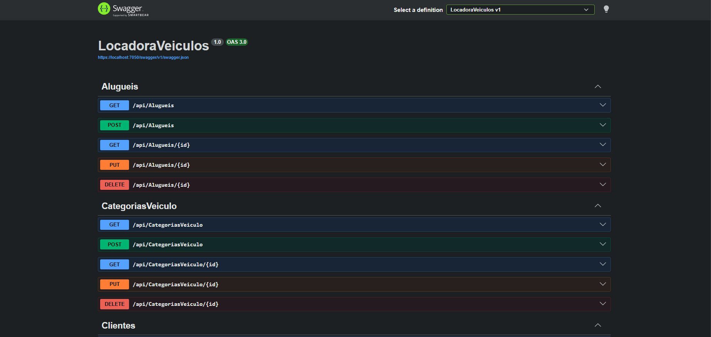
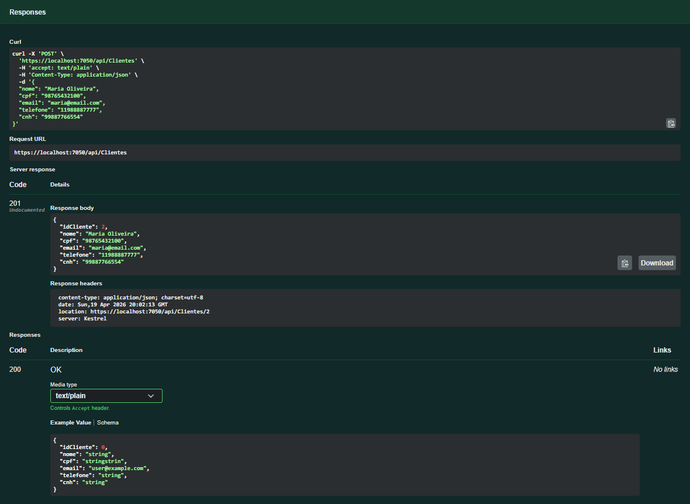
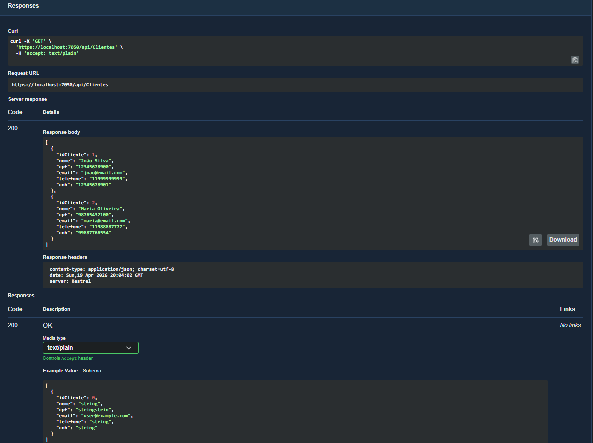
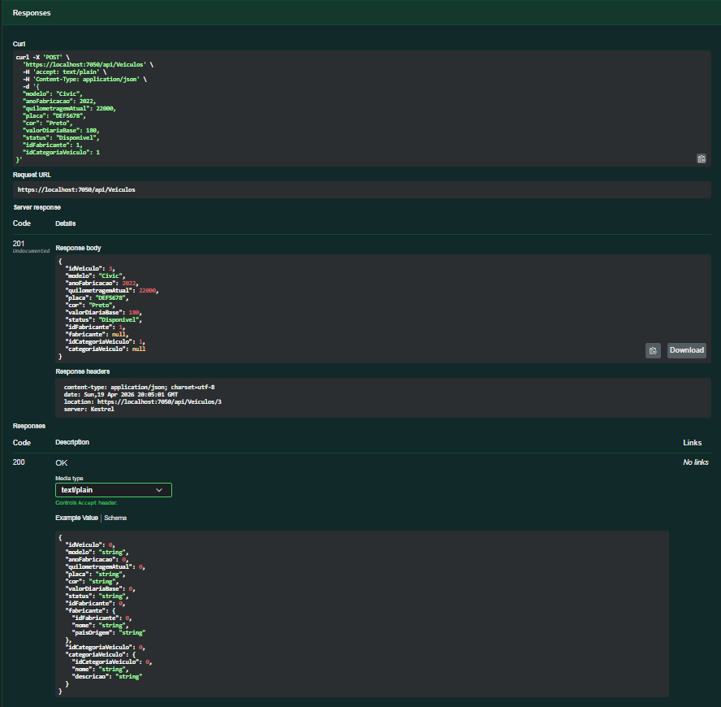
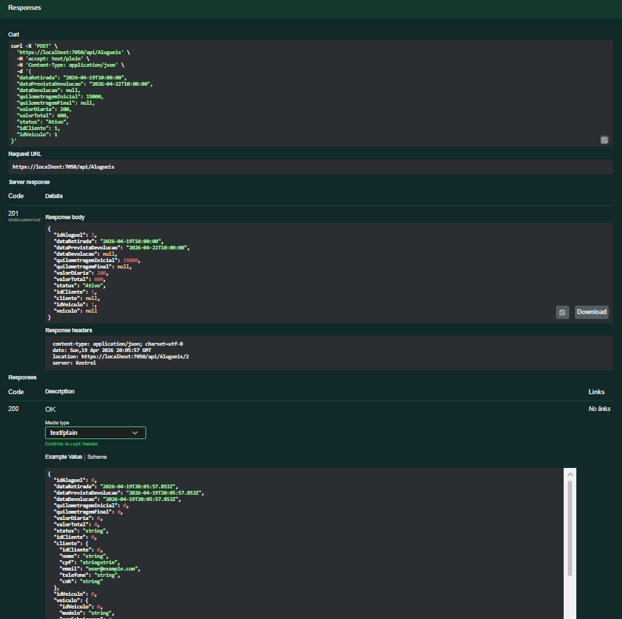
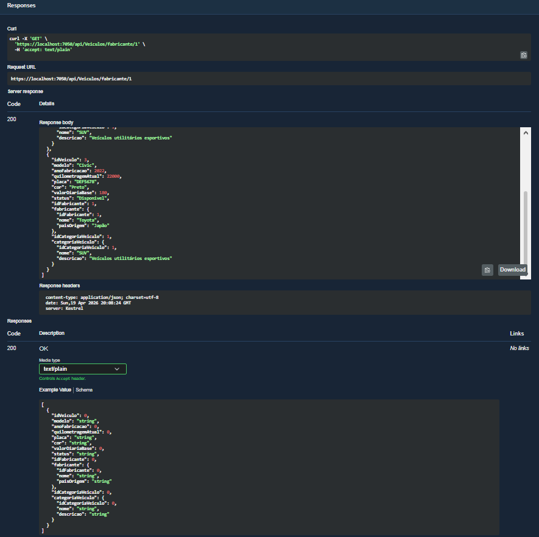
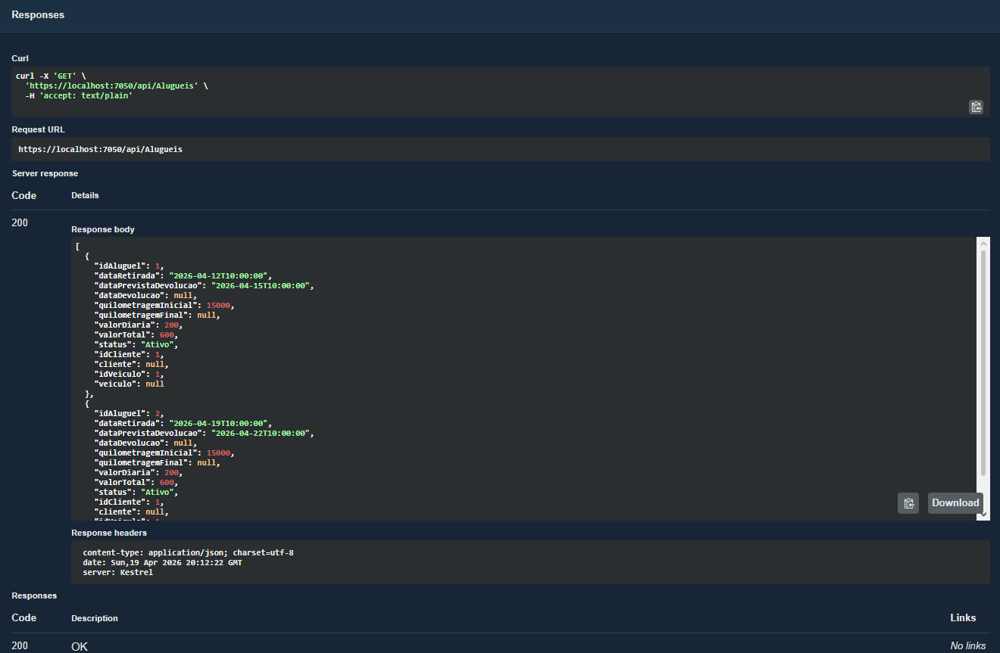
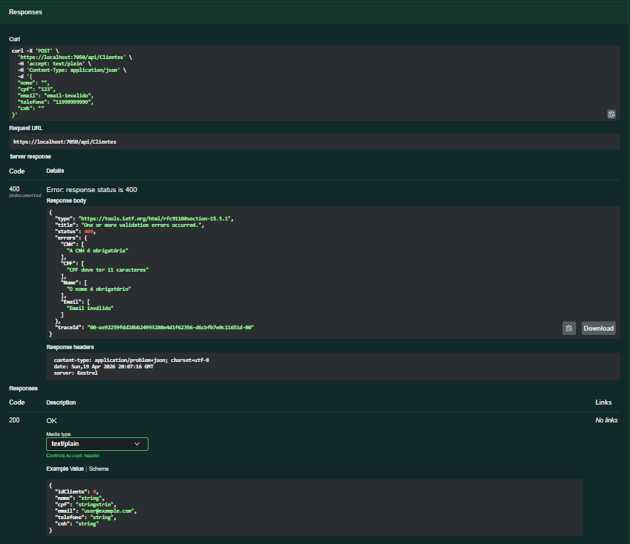

# 🧪 Testes da API - Locadora de Veículos

## 📌 Objetivo
Validar o funcionamento dos endpoints da API utilizando o Swagger, garantindo que todas as operações estejam funcionando corretamente, incluindo cenários de sucesso e erro.

---

## 🚀 Ambiente de Testes

- Ferramenta: Swagger (OpenAPI)
- URL: https://localhost:7050/swagger
- Banco de dados: SQL Server
- Backend: ASP.NET Core

---

## 📊 Testes Realizados

---

### 🔹 1. Swagger em execução

Verificação da interface do Swagger carregando corretamente com todos os endpoints disponíveis.

---

### 🔹 2. Cadastro de Cliente (POST /api/Clientes)

Teste de criação de um cliente com dados válidos.

Resultado esperado: `201 Created`

---

### 🔹 3. Listagem de Clientes (GET /api/Clientes)

Consulta de todos os clientes cadastrados.

Resultado esperado: `200 OK`

---

### 🔹 4. Cadastro de Veículo (POST /api/Veiculos)

Teste de criação de um veículo com dados válidos.

Resultado esperado: `201 Created`

---

### 🔹 5. Cadastro de Aluguel (POST /api/Alugueis)

Teste de criação de um aluguel relacionando cliente e veículo.

Resultado esperado: `201 Created`

---

### 🔹 6. Filtro de Veículos por Fabricante (GET /api/Veiculos/fabricante/{idFabricante})

Teste de listagem de veículos filtrando por fabricante.

Resultado esperado: `200 OK`

---

### 🔹 7. Listagem de Aluguéis (GET /api/Alugueis)

Consulta de todos os aluguéis cadastrados.

Resultado esperado: `200 OK`

---

### 🔹 8. Validação de erro (POST /api/Clientes)

Teste de envio de dados inválidos para verificar validação da API.

Resultado esperado: `400 Bad Request`

---

## ✅ Conclusão dos Testes

Todos os endpoints principais foram testados com sucesso utilizando o Swagger.  

A API apresentou comportamento esperado nos cenários de:
- Sucesso (200 e 201)
- Consulta de dados
- Filtros
- Relacionamentos entre entidades
- Validação de dados inválidos (400)

Os testes demonstram que o sistema está funcional, consistente e preparado para utilização conforme os requisitos propostos.

---
